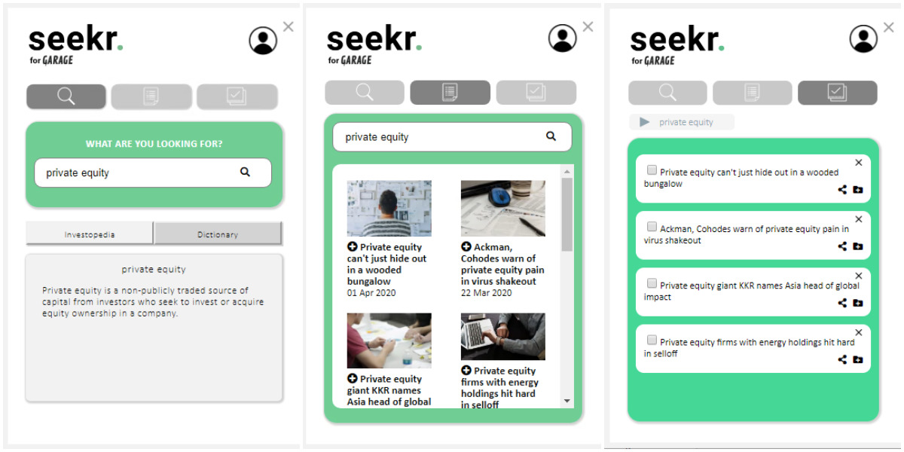

# Seekr

Seekr is a Google Chrome extension that allows users to better connect with startup news by improving their understanding of business terms, expanding their knowledge of business topics by accessing the latest related articles, and organising the information however they need it.

# Table of contents:

1. Introduction
2. Requirements
3. Setup
4. Usage
5. Future Iterations
6. Acknowledgements
7. Team

# 1. Introduction

Seekr aims to:
1. Pique curiousity – it serves as a go-to tool to help tertiary students easily search and understand business jargon.
2. Broaden perspectives – it is the key ingredient for tertiary students to better access and connect with topics in the start-up ecosystem.
3. Manage information – it helps tertiary students get organised with new knowledge.

# 2. Requirements

* python 3
* chrome

# 3. Setup

## 3.1 Adding the extension to chrome toolbar 
1. Download and unzip this code repository.
2. In Google Chrome, open the chrome menu by clicking on the 3 dots at the top right hand corner. Go to More tools > Extensions. (Or go to this link: chrome://extensions/ ).
3. Enable 'Developer mode' in the top right hand corner.
4. Click on 'Load unpacked'.
5. Select the code repository folder, in this case it will be the folder Seekr.
6. You should see a magnifying glass extension' as a chrome extension.
7. Enjoy using the extension

# 4. Usage

### Demo

Watch a demo of Seekr.     

### Key Features

#### • User walkthrough
The welcome screen provides information about the functions of the extension.

#### • Definition search
Users can type and search a term that they do not understand (eg. business jargon) and its definition will appear. Users can toggle between definitions provided by Investopedia or Dictionary.

#### • Related articles
The related articles tab brings users to a page that introduces them to news articles to the term they searched. The 'add' button allows them to bookmark articles for future reference.

#### • Reading List
Clicking on the checklist button will allow users to access their bookmarked articles. Here, they can check off and delete an article after reading it.

#### • Folder function
Users can create folders and organize articles for future reading.

#### • Sharing
Users can share articles on social media and messaging platforms.

# 5. Future Iterations

We hope to improve the product through further iterations: 

* Allow users to search for terms by simply highlighting words found in news articles.
* Enable push notifications to flag unread stories for users.
* Introduce user accounts/guest modes to make news-reading more social.

# 6. Acknowledgements

Ms Jessica Tan and Miss Joan Kelly for their guidance throughout the News Media Lab course. 

Our news partner Olivia Poh from Garage @ The Business Times for her continuous support and valuable feedback.

Our industry mentor Janie Octia from CrowdTangle @ Facebook for her expert guidance. 

Users from our research process, for providing us with insightful comments and feedback.

# 7. Team
Journalists: Yeo Sze-G and Sherlyn Seah 
Designers: Esther Rim and Namita Kumar 
Developer: Goh Yong Wei
